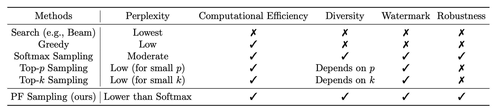
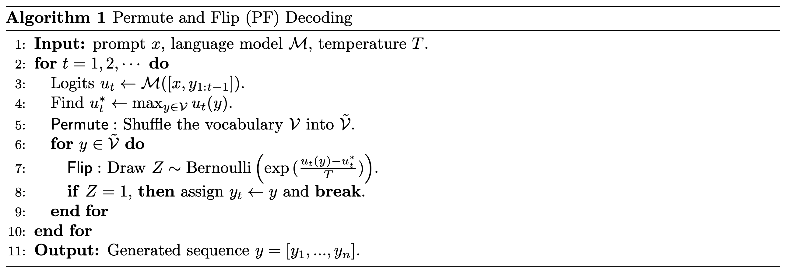
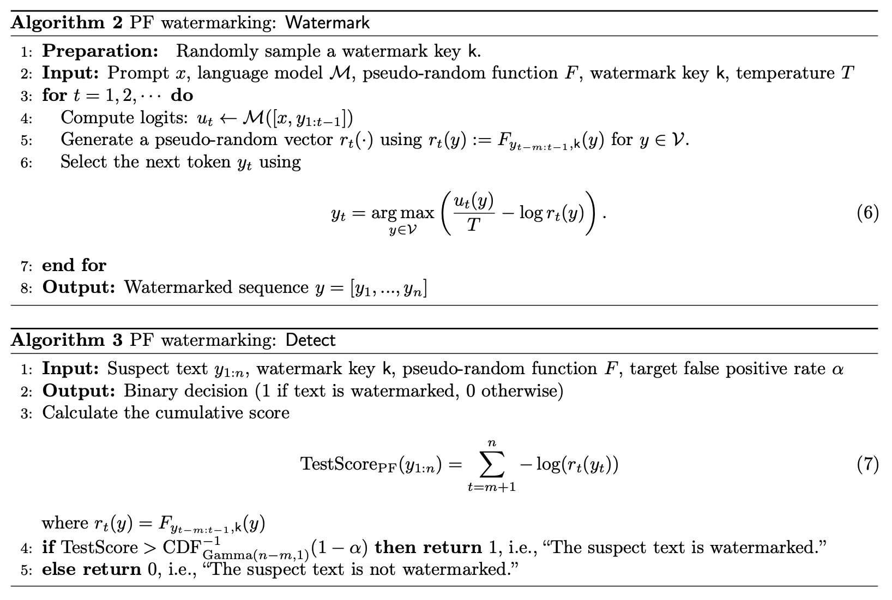

# pf-decoding
Permute-and-Flip: An optimally robust and watermarkable decoder for LLMs

[arXiv page](https://arxiv.org/abs/2402.05864) 


## Introduction
We propose a new decoding method called Permute-and-Flip (PF) decoder. It enjoys robustness properties similar to the standard sampling decoder, but is provably up to 2x better in its quality-robustness tradeoff than sampling and never worse than any other decoder. We also design a cryptographic watermarking scheme analogous to Aaronson's Gumbel watermark, but naturally tailored for PF decoder. The watermarking scheme does not change the distribution to sample, while allowing arbitrarily low false positive rate and high recall whenever the generated text has high entropy. Our experiments show that the PF decoder (and its watermarked counterpart) significantly outperform(s) naive sampling (and it's Gumbel watermarked counterpart) in terms of perplexity, while retaining the same robustness (and detectability), hence making it a promising new approach for LLM decoding. 
<!--  -->
<div align="center">
    
</div>

## Algorithm
The PF decoder is a simple and efficient algorithm that can be used to decode any LLM. It is based on the idea of sampling from the distribution of the LLM, but with a twist. The algorithm is as follows:
<!--  -->
<div align="center">
    
</div>

## Watermarking
We also propose a watermarking scheme for the PF decoder. The watermarking scheme is as follows:
<!--  -->
<div align="center">
    
</div>

## Code
The code is written in Python and uses PyTorch. You can run the code using the following command:
```bash
python run.py --model_name 'NousResearch/Llama-2-7b-hf' --prompt_path 'data/c4.jsonl' --temperature 0.9 --top_p 1.0 --ngram 8 --max_gen_len 256 --nsamples 600 --batch_size 8
```
You can set the parameters in the `run.py` file. 

## Acknowledgements
We thank the authors of the following research works and open-source projects:

[Three Bricks to Consolidate Watermarks for Large Language Models](https://github.com/facebookresearch/three_bricks)

## Citation
If you find this work useful, please consider citing our paper:
```
@article{zhao2024permute,
  title={Permute-and-Flip: An optimally robust and watermarkable decoder for LLMs},
  author={Zhao, Xuandong and Li, Lei and Wang, Yu-Xiang},
  journal={arXiv preprint arXiv:2402.05864},
  year={2024}
}
```
